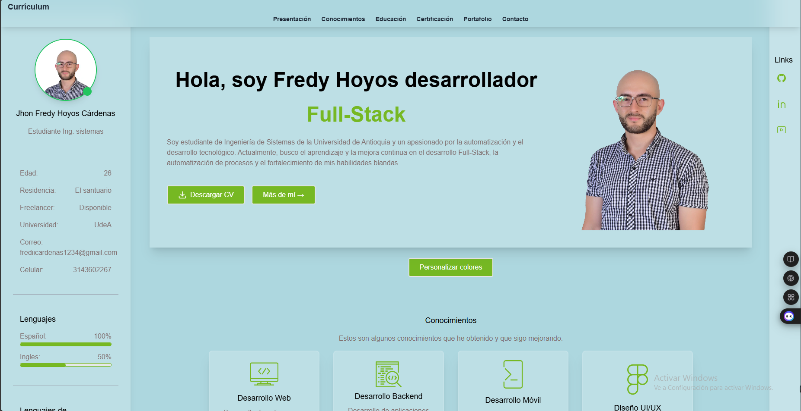

# Portafolio de Jhon Fredy Hoyos Cárdenas

Este proyecto ya está desplegado en el siguiente link:  https://jhon-fredy-hoyos-cardenas-portafolio.vercel.app/ 

Bienvenido al repositorio de mi portafolio personal, donde comparto mis proyectos y experiencias como desarrollador web. Este sitio está construido con **Next.js**, **Tailwind CSS** y **TypeScript**, y está alojado en **Vercel**.

## 🚀 Tecnologías utilizadas

- **Next.js**: Framework de React para aplicaciones web.
- **Tailwind CSS**: Framework de diseño para una interfaz moderna y responsiva.
- **TypeScript**: Lenguaje que mejora la calidad del código con tipado estático.
- **Vercel**: Plataforma de despliegue para aplicaciones frontend.

## 🛠️ Instalación y ejecución local

Para ejecutar este proyecto en tu máquina local, sigue estos pasos:

1. Clona el repositorio:
   git clone https://github.com/FredyHoyos/jhon-fredy-hoyos-cardenas-portafolio.git
   cd jhon-fredy-hoyos-cardenas-portafolio

2. Instala las dependencias:

   npm install

3. Ejecuta el servidor de desarrollo:
   npm run dev

3. Abre tu navegador y visita http://localhost:3000 para ver el portafolio en acción.
   



This is a [Next.js](https://nextjs.org) project bootstrapped with [`create-next-app`](https://nextjs.org/docs/pages/api-reference/create-next-app).

## Getting Started

First, run the development server:

```bash
npm run dev
# or
yarn dev
# or
pnpm dev
# or
bun dev
```

Open [http://localhost:3000](http://localhost:3000) with your browser to see the result.

You can start editing the page by modifying `pages/index.tsx`. The page auto-updates as you edit the file.

[API routes](https://nextjs.org/docs/pages/building-your-application/routing/api-routes) can be accessed on [http://localhost:3000/api/hello](http://localhost:3000/api/hello). This endpoint can be edited in `pages/api/hello.ts`.

The `pages/api` directory is mapped to `/api/*`. Files in this directory are treated as [API routes](https://nextjs.org/docs/pages/building-your-application/routing/api-routes) instead of React pages.

This project uses [`next/font`](https://nextjs.org/docs/pages/building-your-application/optimizing/fonts) to automatically optimize and load [Geist](https://vercel.com/font), a new font family for Vercel.

## Learn More

To learn more about Next.js, take a look at the following resources:

- [Next.js Documentation](https://nextjs.org/docs) - learn about Next.js features and API.
- [Learn Next.js](https://nextjs.org/learn-pages-router) - an interactive Next.js tutorial.

You can check out [the Next.js GitHub repository](https://github.com/vercel/next.js) - your feedback and contributions are welcome!

## Deploy on Vercel

The easiest way to deploy your Next.js app is to use the [Vercel Platform](https://vercel.com/new?utm_medium=default-template&filter=next.js&utm_source=create-next-app&utm_campaign=create-next-app-readme) from the creators of Next.js.

Check out our [Next.js deployment documentation](https://nextjs.org/docs/pages/building-your-application/deploying) for more details.
